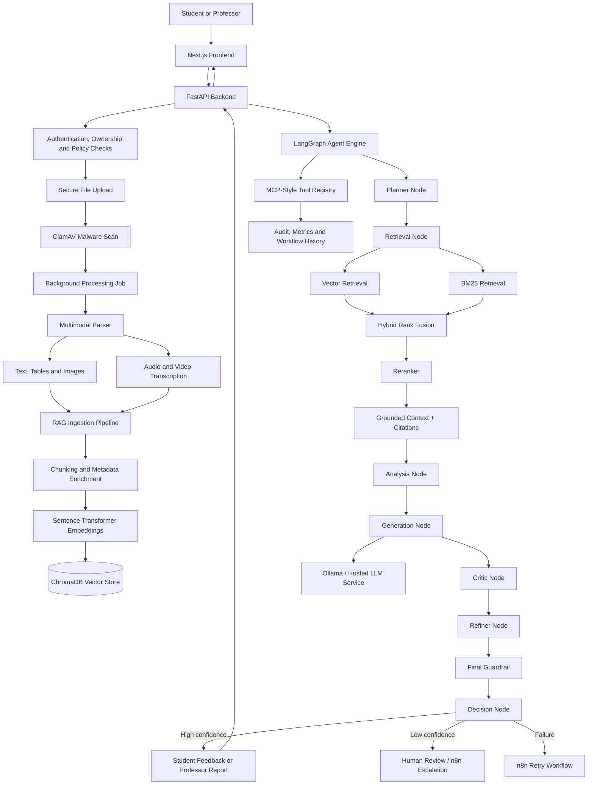
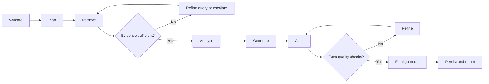
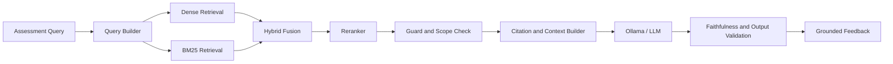
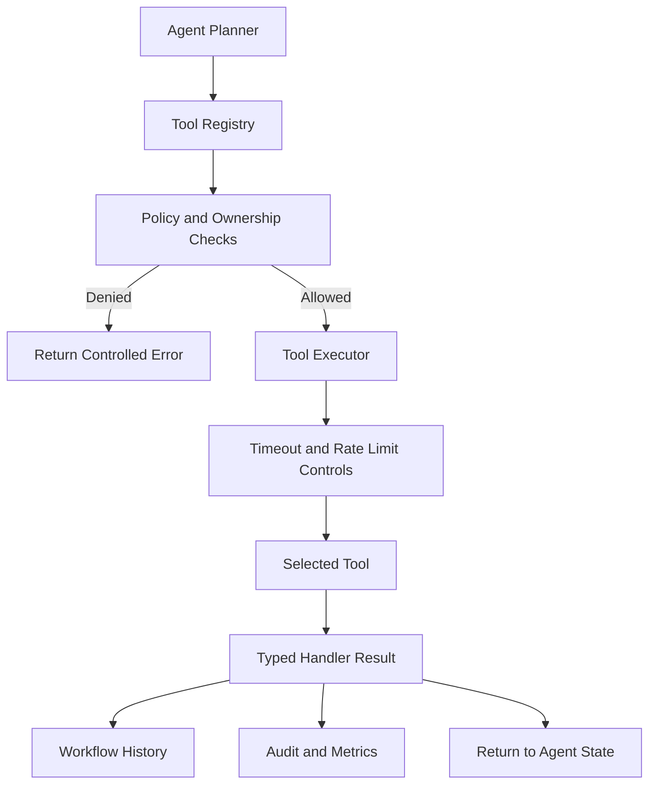

# EduAIPlatform


A secure, full-stack **Generative AI and Agentic AI platform** for automated student assignment assessment, professor review, multimodal document processing, retrieval-augmented generation, explainable feedback and workflow automation.

EduAIPlatform combines **LangChain, LangGraph, Ollama, ChromaDB, hybrid RAG, MCP-style tools, n8n, FastAPI, PyTorch/ONNX and Next.js** in a modular AI system designed around grounded generation, workflow control, security, auditability and human review.

---

## Project Highlights

- Built separate **student and professor agent workflows** using LangGraph.
- Implemented **planner, retrieval, analysis, critic, refiner, decision and guardrail nodes**.
- Developed an end-to-end **RAG pipeline** with ingestion, chunking, embeddings, vector search, BM25 retrieval, hybrid ranking, reranking, confidence scoring and citations.
- Integrated **Ollama** for local LLM inference with optional hosted-model support.
- Used **LangChain** for prompt management, chain construction, parsing, routing and retrieval integration.
- Implemented **MCP-style tool orchestration** with a registry, planner, executor, policies, audit records, ownership validation, rate limits and workflow history.
- Automated assessment, audit and exception-handling workflows using **n8n**.
- Added low-confidence escalation, failed-pipeline retry and human-review-oriented control paths.
- Added RAG evaluation artefacts and tracing-oriented components.
- Containerised the multi-service platform with Docker Compose.

---

## Problem Statement

Educational assessment platforms must process complex and often unstructured submissions while producing feedback that is:

- Relevant to the submitted work
- Grounded in course and rubric evidence
- Suitable for the user's role
- Explainable and traceable
- Secure across different users and courses
- Resilient when models, tools or retrieval components fail
- Escalated to a human when confidence is insufficient

EduAIPlatform addresses these requirements through a layered AI architecture rather than relying on a single unrestricted LLM call.

---

## System Architecture



---

## Agentic AI with LangGraph

The platform contains dedicated LangGraph modules for orchestrating stateful, multi-step assessment workflows.

### Implemented graphs

- Student assessment graph
- Student generative assessment graph
- Professor assessment graph
- Professor generative assessment graph

The separate graph paths allow the platform to apply different prompts, policies, evidence requirements and output formats for students and professors.

### Agent nodes

The LangGraph implementation includes nodes for:

| Node | Responsibility |
|---|---|
| Input validation | Validates request structure and required fields |
| Ingestion | Prepares parsed submission content |
| Planner | Determines the next workflow steps |
| Retrieval | Retrieves relevant assignment, rubric and knowledge context |
| Evidence sufficiency | Checks whether retrieved evidence is adequate |
| Analysis | Analyses submission content against the available context |
| ML inference | Adds machine-learning model outputs where appropriate |
| ML context | Transforms ML results into workflow context |
| Generator | Produces a candidate response |
| Critic | Reviews the candidate for quality and evidence support |
| Refiner | Improves the response based on critic feedback |
| Policy check | Enforces workflow and access policies |
| RAG decision | Determines whether retrieval evidence is sufficient |
| ML decision | Interprets model-level outputs |
| Safe-mode decision | Selects a restricted path when components are unavailable |
| Final guardrail | Validates the final response before release |
| Persistence | Stores workflow outcomes and traces |
| Fallback | Handles failed or unavailable components |
| MCP tools | Invokes controlled external or internal tools |

### Controlled agent loop



Loop-control, policy and state modules are separated from the graph nodes to prevent uncontrolled iteration and to make workflow execution easier to test and audit.

---

## Retrieval-Augmented Generation

The platform contains a full RAG subsystem rather than only a vector-database folder.

### Ingestion

The ingestion layer processes educational content and submission artefacts through:

1. File validation and security scanning
2. Text and multimodal extraction
3. Content normalisation
4. Chunk creation
5. Metadata enrichment
6. Embedding generation
7. Vector-store persistence
8. Integrity validation

### Embeddings and vector storage

- Sentence Transformers generate semantic embeddings.
- ChromaDB stores vectors and associated metadata.
- A persisted `chroma.sqlite3` database supports local development.
- Metadata can be used to scope retrieval by user, course, assignment, document type or other ownership attributes.

### Hybrid retrieval

The retrieval stack combines:

- Dense semantic vector retrieval
- BM25 lexical retrieval
- Hybrid result fusion
- Query construction and topic detection
- Reranking
- Confidence calculation
- Retrieval guards
- Citation assembly
- Trace generation

This improves retrieval when exact rubric terminology and semantically similar content must both be considered.

### Grounded generation pipeline



### RAG quality controls

The implementation includes components for:

- Citation generation
- Confidence scoring
- Retrieval and generation guards
- Data-integrity checking
- Query building
- Topic detection
- Retrieval tracing
- Caching
- RAG analytics
- Evaluation result storage

---

## LangChain Integration

LangChain is used as an application layer around LLM and retrieval operations.

The codebase contains dedicated modules for:

- Chain construction
- Prompt templates
- Input and output parsers
- Request routing
- Service abstractions
- Typed models and schemas
- LangChain-specific tests
- Chroma integration
- Hugging Face embeddings
- Text splitting

The dependency configuration includes:

```text
langchain
langchain-community
langchain-text-splitters
langchain-chroma
langchain-huggingface
```

This structure keeps prompt, parsing, retrieval and model-provider logic separate from the main API and LangGraph orchestration layers.

---

## Generative AI Layer

The platform contains an independent GenAI package supporting:

- Prompt templates
- Typed generation schemas
- Deterministic fallback behaviour
- Output consistency checking
- Explainability
- Fairness-oriented processing
- PDF report generation
- Configurable model services

The GenAI layer is used by the LangGraph workflow but remains independently testable.

---

## Ollama and LLM Service

The independent LLM service supports local inference through Ollama.

### Features

- Configurable primary model
- Configurable fallback model
- Temperature, top-p and top-k controls
- Maximum input and output limits
- Request timeouts
- Provider abstraction
- Structured prompts and schemas
- Separate student and professor prompt paths
- Optional Anthropic integration
- Service-level security checks

### Example configuration

```env
LLM_PROVIDER=ollama
OLLAMA_BASE_URL=http://host.docker.internal:11434
OLLAMA_PRIMARY_MODEL=gemma3:4b
OLLAMA_FALLBACK_MODEL=phi3:mini

OLLAMA_TEMPERATURE=0.15
OLLAMA_TOP_P=0.9
OLLAMA_TOP_K=40

LLM_TIMEOUT_SECONDS=120
LLM_MAX_INPUT_CHARS=12000
```

Pull the configured models before starting the stack:

```bash
ollama pull gemma3:4b
ollama pull phi3:mini
ollama serve
```

---

## MCP-Style Tool Orchestration

The backend contains a structured tool-execution layer for agent workflows.

### Core components

- Tool registry
- Tool schemas and typed handler results
- LLM-assisted planner
- Deterministic executor
- Workflow rules
- Access and ownership checks
- Rate limits
- Timeouts
- Error handling
- Docker and GitHub client adapters
- Audit logging
- Metrics
- Cache
- Workflow history repository and service

### Execution model



The model proposes tool use, while deterministic code verifies permissions, policies and execution constraints.

---

## n8n Workflow Automation

The repository contains deployable n8n infrastructure and versioned JSON workflows.

### Assessment workflows

- Student assessment workflow
- Professor assessment workflow
- Administrator model-usage audit workflow

### Operational workflows

- File-upload event workflow
- Failed-pipeline retry workflow
- Low-confidence escalation workflow

These workflows connect application events with operational actions such as retrying failed jobs, routing uncertain AI outputs for review and auditing model activity.

---

## Multimodal Processing

EduAIPlatform supports educational content beyond plain text.

### Supported processing paths

- PDF and document text extraction
- Table processing
- Image extraction
- Audio transcription
- Video audio extraction and transcription
- Whisper-based speech-to-text
- Configurable file-size and duration limits
- Separate light and heavy workers

The parser and worker design keeps expensive multimodal processing away from synchronous API requests.

---

## Service Architecture

| Service | Default port | Responsibility |
|---|---:|---|
| Frontend | `3000` | Student and professor web experience |
| Backend | `8000` | API, authentication, jobs, RAG and agent orchestration |
| AI service | `8010` | ML inference and model-serving functionality |
| Parser | `8020` | Document and multimodal parsing |
| LLM service | `8030` | Ollama and optional hosted-LLM inference |
| ClamAV | `3310` | Uploaded-file malware scanning |
| n8n | Configurable | Event-driven workflow automation |

---

## Repository Structure

```text
EduAIPlatform/
├── .github/
├── ai-service/
├── backend/
│   ├── app/
│   │   ├── api/
│   │   ├── core/
│   │   ├── events/
│   │   ├── genai/
│   │   ├── langchain/
│   │   │   ├── parsers/
│   │   │   ├── prompts/
│   │   │   ├── routers/
│   │   │   ├── services/
│   │   │   └── tests/
│   │   ├── langgraph/
│   │   │   ├── adapters/
│   │   │   ├── graphs/
│   │   │   ├── nodes/
│   │   │   └── tracing/
│   │   ├── mcp/
│   │   │   └── tools/
│   │   ├── rag/
│   │   │   ├── analytics/
│   │   │   ├── cache/
│   │   │   ├── ingestion/
│   │   │   ├── retrieval/
│   │   │   ├── security/
│   │   │   └── utils/
│   │   ├── services/
│   │   └── worker/
│   ├── knowledge/
│   ├── tests/
│   └── rag_evaluation_results.csv
├── frontend/
├── infra/
│   └── n8n/
│       └── workflows/
├── llm-service/
│   ├── app/
│   └── tests/
├── parser/
├── storage/
│   └── rag/
│       └── chroma.sqlite3
├── docker-compose.yml
└── README.md
```

---

## Technology Stack

| Area | Technologies |
|---|---|
| Agent orchestration | LangGraph |
| LLM application framework | LangChain |
| Local LLM inference | Ollama |
| Optional hosted LLM | Anthropic |
| RAG and vector database | ChromaDB, Sentence Transformers |
| Hybrid retrieval | Dense retrieval, BM25, reranking |
| Tool orchestration | MCP-style registry, planner and executor |
| Workflow automation | n8n |
| Backend | FastAPI, Pydantic |
| ML | PyTorch, ONNX, Hugging Face |
| Frontend | Next.js, TypeScript |
| Parsing | PDF/document parsers, faster-whisper |
| Security | JWT, service secrets, ClamAV, ownership checks |
| Infrastructure | Docker Compose |
| Testing | Pytest, service and workflow tests |

---

## Quick Start

### Prerequisites

- Git
- Docker and Docker Compose
- Ollama
- A configured local LLM
- Supabase credentials for enabled database and storage features

### 1. Clone the repository

```bash
git clone https://github.com/Ansh2303sahu/EduAIPlatform.git
cd EduAIPlatform
```

### 2. Configure environment variables

```bash
cp .env.example .env
```

Create or review the service-specific environment files expected by Docker Compose, including backend and AI-service configuration.

Important values include:

```env
ENV=development
JWT_SECRET=replace_with_a_long_random_secret
ALLOWED_ORIGINS=http://localhost:3000

SUPABASE_URL=https://YOUR_PROJECT.supabase.co
SUPABASE_ANON_KEY=
SUPABASE_SERVICE_ROLE_KEY=

AI_SERVICE_SECRET=replace_with_a_secure_secret

LLM_PROVIDER=ollama
OLLAMA_BASE_URL=http://host.docker.internal:11434
OLLAMA_PRIMARY_MODEL=gemma3:4b
OLLAMA_FALLBACK_MODEL=phi3:mini
```

Do not commit secrets.

### 3. Start Ollama

```bash
ollama pull gemma3:4b
ollama pull phi3:mini
ollama serve
```

### 4. Start the platform

```bash
docker compose up --build
```

Run in detached mode:

```bash
docker compose up --build -d
```

### 5. Check the services

```bash
docker compose ps
```

Useful endpoints:

- Frontend: `http://localhost:3000`
- Backend API: `http://localhost:8000`
- Swagger UI: `http://localhost:8000/docs`
- AI service: `http://localhost:8010`
- LLM service: `http://localhost:8030`

### 6. Stop the platform

```bash
docker compose down
```

---

## End-to-End Assessment Flow

1. A student or professor submits an assignment or assessment request.
2. Authentication, ownership and role policies are checked.
3. Uploaded files are validated and scanned using ClamAV.
4. A background worker starts the appropriate parsing pipeline.
5. Text, tables, images or transcribed media are extracted.
6. The RAG ingestion layer chunks and enriches the content.
7. Sentence Transformer embeddings are stored in ChromaDB.
8. LangGraph selects the student or professor workflow.
9. The planner determines the required retrieval, ML and generation steps.
10. Dense and BM25 retrieval results are combined and reranked.
11. Evidence sufficiency and confidence checks are applied.
12. The GenAI layer generates a candidate response through Ollama.
13. Critic and refiner nodes improve the result.
14. Policy and final guardrail nodes validate the output.
15. High-confidence outputs are returned and persisted.
16. Low-confidence or failed workflows are routed through n8n escalation or retry paths.
17. Tool calls, model use and workflow results are logged for auditability.

---

## Security and Governance

### Input security

- Malware scanning with ClamAV
- File-size and media-duration limits
- Authentication and JWT validation
- Role and ownership checks
- Service-to-service secrets
- Rate limiting

### RAG security

- Scoped retrieval
- Ownership-aware context access
- Retrieval guard components
- Integrity checking
- Metadata filtering
- Citation-based evidence tracking

### Agent safety

- Typed graph state
- Controlled loop limits
- Planner and executor separation
- Tool allow-list through the registry
- Policy checks before execution
- Timeouts and rate limits
- Safe-mode and fallback paths
- Final output guardrail
- Low-confidence escalation

### Auditability

- Workflow history
- MCP tool audit events
- Model-usage audit workflow
- RAG traces
- Evaluation results
- Metrics and structured handler results

---

## Evaluation

The repository contains RAG evaluation output and testing packages across the backend, LLM service and LangChain modules.

Recommended evaluation dimensions include:

| Layer | Metrics |
|---|---|
| Retrieval | Recall@k, precision@k, MRR, context relevance |
| Reranking | Ranking improvement and top-k relevance |
| Generation | Faithfulness, relevance, completeness and rubric coverage |
| Agents | Task completion, correct routing and decision accuracy |
| Tools | Tool-selection accuracy, execution success and policy compliance |
| Safety | Unsupported-claim rate, prompt-injection resistance and data isolation |
| Operations | P50/P95 latency, retry rate, fallback rate and cost |
| Human review | Reviewer agreement and escalation precision |

Run the backend tests with:

```bash
cd backend
pytest -q
```

---

## Example Interview Explanation

> EduAIPlatform is a secure, multi-service GenAI assessment platform. I implemented an end-to-end hybrid RAG pipeline using Sentence Transformers, ChromaDB and BM25, with reranking, confidence scoring and citations. LangChain manages retrieval and prompt components, while LangGraph orchestrates separate stateful student and professor agent workflows containing planner, retrieval, evidence, generation, critic, refiner, policy and guardrail nodes. Ollama provides local LLM inference, and n8n handles assessment automation, failed-workflow retries, model-usage auditing and low-confidence escalation. The system also includes MCP-style controlled tool execution, multimodal parsing, background workers, Docker services and security controls such as malware scanning and ownership-aware retrieval.

---

## Skills Demonstrated

- Agentic AI architecture
- LangGraph stateful orchestration
- LangChain application development
- Retrieval-augmented generation
- Hybrid semantic and lexical retrieval
- Embeddings and vector databases
- Reranking and citation generation
- Local LLM deployment with Ollama
- Prompt and output engineering
- MCP-style tool calling
- n8n workflow automation
- FastAPI microservices
- Multimodal AI pipelines
- AI safety and guardrails
- Workflow auditability
- Docker and distributed service design
- Testing and RAG evaluation

---

## Roadmap

The following are future enhancements rather than descriptions of the existing core stack:

- [ ] Add OpenTelemetry distributed tracing dashboards
- [ ] Add a dedicated prompt-injection benchmark suite
- [ ] Add automated faithfulness scoring to CI
- [ ] Add production secrets management
- [ ] Add Kubernetes deployment manifests
- [ ] Add managed vector-store deployment options
- [ ] Add token and infrastructure cost dashboards
- [ ] Add LoRA/QLoRA domain adaptation experiments
- [ ] Add an approval dashboard for escalated assessments
- [ ] Add automated red-team datasets for agent and RAG workflows

---

## Disclaimer

EduAIPlatform is an educational and portfolio project. AI-generated feedback should assist rather than replace qualified academic judgement. A real institutional deployment would require additional privacy, safeguarding, accessibility, security, bias and governance review.

---

## Author

**Ansh Sahu**  
BEng Computer Science (Honours)  
Focus: LLM Engineering, Agentic AI, RAG, LangGraph, LangChain and Production AI Systems
