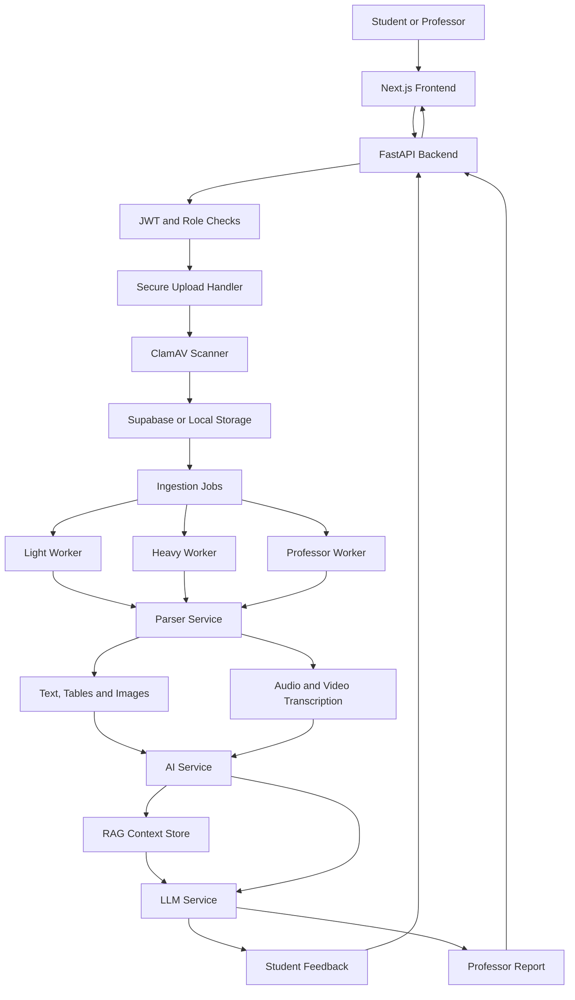
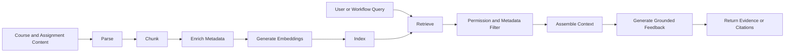

 EduAIPlatform


A secure, service-oriented AI platform for **automated assignment ingestion, multimodal content processing, machine-learning analysis, retrieval-augmented context, and LLM-generated student and professor feedback**.

The project demonstrates how a full-stack application can coordinate document parsing, malware scanning, asynchronous workers, local or hosted LLMs, ML services, and role-aware feedback workflows.

---

## Overview

EduAIPlatform processes educational submissions through an end-to-end pipeline:

```text
Frontend → Backend → Secure Upload → Workers → Parser → AI Service → LLM Service → Feedback
```

The repository is organised as multiple services rather than a single monolithic application. This allows parsing, AI inference, LLM generation, and background processing to scale and fail independently.

---

## Implemented Capabilities

### Secure assignment ingestion

- Controlled file uploads
- Configurable upload limits
- ClamAV malware scanning
- Separate storage and retention settings
- Background ingestion workers
- Retry and lock-timeout controls

### Multimodal parsing

- Text and document parsing
- Table and image extraction limits
- Audio and video processing
- Whisper-based transcription
- Separate lightweight and heavyweight worker modes

### AI and ML service

- Independent FastAPI AI service
- PyTorch and ONNX support
- Hugging Face model cache
- Model artefact directory separation
- Service-to-service authentication secret

### LLM service

- Local model execution through Ollama
- Configurable primary and fallback models
- Optional Anthropic provider configuration
- Controlled context and output-token budgets
- Low-temperature structured generation
- Timeouts and retry settings
- Separate feedback paths for students and professors

### Retrieval and workflow infrastructure

- RAG-oriented storage module
- Parsing and enrichment stages
- Background worker orchestration
- n8n infrastructure directory for workflow automation
- Supabase integration for storage and application data

---

## Architecture



---

## Service Map

| Service | Default port | Responsibility |
|---|---:|---|
| Frontend | `3000` | User interface |
| Backend | `8000` | API, authentication, storage, jobs and workflow control |
| AI service | `8010` | ML inference and AI analysis |
| Parser | `8020` | Document and media parsing |
| LLM service | `8030` | Local or hosted LLM generation |
| ClamAV | `3310` | Malware scanning |

Ports and service details may be changed through environment configuration.

---

## Repository Structure

```text
EduAIPlatform/
├── .github/                  # CI and repository automation
├── ai-service/               # ML and AI inference service
├── backend/                  # Core FastAPI API and background workers
├── docs/                     # Technical documentation
├── frontend/                 # Next.js user interface
├── infra/
│   └── n8n/                  # Workflow automation assets
├── llm-service/              # Ollama/Anthropic model service
├── notebooks/                # Exploration and model development
├── parser/                   # Document, table, image and media parsing
├── storage/
│   └── rag/                  # Retrieval-oriented storage assets
├── tools/
│   └── claude-cli/           # Development tooling
├── .env.example
├── docker-compose.yml
├── openapi.json
└── README.md
```

---

## Technology Stack

| Layer | Technologies |
|---|---|
| Frontend | Next.js, TypeScript |
| Backend | FastAPI, Python |
| AI/ML | PyTorch, ONNX, Hugging Face |
| LLMs | Ollama, Mistral/Gemma/Phi configurations, optional Anthropic |
| Parsing | Python document parsers, Whisper |
| Storage | Supabase, local Docker volumes |
| Security | JWT, service secrets, ClamAV |
| Infrastructure | Docker Compose, n8n |
| Languages | Python, TypeScript, JavaScript, Shell |

---

## Quick Start with Docker Compose

### Prerequisites

- Docker Desktop or Docker Engine with Compose
- Git
- At least one local Ollama model when using the default local provider
- A Supabase project when enabling Supabase-backed features

### 1. Clone the repository

```bash
git clone https://github.com/Ansh2303sahu/EduAIPlatform.git
cd EduAIPlatform
```

### 2. Create environment files

Start from the provided template:

```bash
cp .env.example .env
```

The Compose configuration also expects service-level environment files such as:

```text
backend/.env
ai-service/.env
```

Create them from the relevant examples or copy the required values from the root environment template.

On Windows PowerShell:

```powershell
Copy-Item .env.example .env
```

### 3. Configure required values

At minimum, review:

```bash
ENV=development
JWT_SECRET=replace_with_a_long_random_secret
ALLOWED_ORIGINS=http://localhost:3000

SUPABASE_URL=https://YOUR_PROJECT.supabase.co
SUPABASE_ANON_KEY=
SUPABASE_SERVICE_ROLE_KEY=
ASSIGNMENTS_BUCKET=assignments

AI_SERVICE_SECRET=replace_me
LLM_PROVIDER=ollama
OLLAMA_BASE_URL=http://host.docker.internal:11434
OLLAMA_PRIMARY_MODEL=gemma3:4b
OLLAMA_FALLBACK_MODEL=phi3:mini
```

Never expose `SUPABASE_SERVICE_ROLE_KEY`, service secrets, or real API keys in the frontend or repository.

### 4. Install and start Ollama

Example:

```bash
ollama pull gemma3:4b
ollama pull phi3:mini
ollama serve
```

The repository's Compose configuration may use a different primary model label. Ensure the configured model exists locally.

### 5. Start the platform

```bash
docker compose up --build
```

Run in the background:

```bash
docker compose up --build -d
```

### 6. Check service health

```bash
docker compose ps
```

Useful local endpoints:

- Backend: `http://localhost:8000`
- Backend docs: `http://localhost:8000/docs`
- AI service: `http://localhost:8010`
- LLM service: `http://localhost:8030`

### 7. Stop the platform

```bash
docker compose down
```

To remove local named volumes as well:

```bash
docker compose down -v
```

Use the `-v` option carefully because it deletes persisted development data and caches.

---

## Core Processing Flow

1. A student or professor authenticates through the application.
2. The backend validates role, request metadata, and upload size.
3. The uploaded file is scanned by ClamAV.
4. The backend stores the accepted file and creates an ingestion job.
5. A light or heavy worker claims the job.
6. The parser extracts supported text, tables, images, audio, or video content.
7. The AI service performs relevant analysis and feature extraction.
8. Retrieval context is assembled from available course or assignment material.
9. The LLM service generates a bounded, structured response.
10. The backend stores and returns student feedback or a professor-facing report.

---

## Worker Design

The platform separates workloads to avoid blocking the API.

### Light worker

Designed for smaller documents and routine ingestion tasks.

### Heavy worker

Handles expensive media or large parsing tasks with settings for:

- Maximum audio and video size
- Maximum media duration
- Audio segmentation
- Whisper model selection
- Lock timeouts and retries

### Professor worker

Runs professor-oriented processing separately, supporting different report requirements and workload controls.

---

## LLM Configuration

The LLM service supports provider-based configuration.

### Local Ollama

```bash
LLM_PROVIDER=ollama
OLLAMA_BASE_URL=http://host.docker.internal:11434
OLLAMA_PRIMARY_MODEL=gemma3:4b
OLLAMA_FALLBACK_MODEL=phi3:mini
OLLAMA_TEMPERATURE=0.15
OLLAMA_TOP_P=0.9
OLLAMA_TOP_K=40
LLM_TIMEOUT_SECONDS=120
LLM_MAX_INPUT_CHARS=12000
```

### Anthropic

When the service is configured for Anthropic:

```bash
LLM_PROVIDER=anthropic
ANTHROPIC_API_KEY=
ANTHROPIC_PRIMARY_MODEL=
ANTHROPIC_FALLBACK_MODEL=
```

Do not commit provider keys.

---

## Security Model

### File security

- ClamAV scans uploaded files
- File-size limits reduce resource exhaustion risk
- Parser limits restrict tables, images, characters, and media duration
- Scanning and processing use controlled Docker volumes

### Service isolation

- Internal Docker networking is used for service communication
- Only selected ports are bound to localhost
- Backend, parser, AI, and LLM services use shared secrets
- AI service configuration can disable external browsing and cross-user access

### Data protection

- Backend-only Supabase credentials remain outside the frontend
- Assignment and AI artefact retention are configurable
- User data should be isolated by authenticated identity and role
- Logs should avoid raw submissions and unnecessary personal information

### LLM safety

Recommended controls include:

- Context ownership checks
- Prompt-injection filtering for retrieved documents
- Output-schema validation
- Maximum context and completion limits
- Provider timeouts and retries
- Model fallbacks
- Separate prompts for student and professor outputs

---

## RAG Pipeline

The repository includes a RAG-oriented storage component. A production-quality retrieval flow should make each stage explicit:



Important retrieval metadata may include:

- User or course ownership
- Assignment identifier
- Document type
- Page or section
- Submission timestamp
- Parser version
- Chunk and embedding version

---

## Evaluation Strategy

A dedicated evaluation harness should measure both component and end-to-end quality.

| Area | Suggested metrics |
|---|---|
| Parsing | Extraction completeness, table accuracy, transcription error rate |
| Retrieval | Recall@k, precision@k, context relevance |
| Generation | Answer relevance, faithfulness, rubric coverage |
| Safety | Cross-user access failures, PII leakage, prompt-injection success rate |
| Workflow | Completion rate, retry rate, worker failure recovery |
| Performance | P50/P95 latency, tokens, cost, queue time |
| User value | Feedback usefulness and reviewer agreement |

Example evaluation dataset structure:

```json
{
  "case_id": "synthetic-001",
  "role": "student",
  "assignment_type": "essay",
  "expected_rubric_points": [
    "clear argument",
    "evidence",
    "critical analysis"
  ],
  "forbidden_claims": [
    "unsupported source attribution"
  ]
}
```

---

## Observability

Recommended production instrumentation:

- Correlation IDs across backend, workers, parser, AI, and LLM services
- Request and job status logs
- Parse and inference duration
- Per-model token usage
- LLM fallback frequency
- Worker queue depth
- ClamAV scan failures
- Retrieval result counts
- Error and retry rates
- Storage and retention events

OpenTelemetry traces and Prometheus-compatible metrics are suitable future additions.

---

## Testing

Because the platform contains several services, testing should cover:

- Unit tests for each service
- API contract tests
- Parser fixture tests
- Worker retry and locking tests
- Service-secret authentication tests
- Upload and malware-rejection tests
- Retrieval permission tests
- LLM schema and fallback tests
- End-to-end Docker Compose smoke tests

Typical commands depend on each service, for example:

```bash
pytest -q
```

and:

```bash
npm test
```

Run commands from the relevant service directory when required.

---

## Production Readiness Checklist

- [ ] Replace all development secrets
- [ ] Restrict CORS to approved origins
- [ ] Configure Supabase row-level security
- [ ] Store secrets in a managed secret store
- [ ] Add rate limiting and request quotas
- [ ] Add PII detection and redaction
- [ ] Add prompt-injection tests
- [ ] Add model and prompt version tracking
- [ ] Add centralised logs, metrics, and traces
- [ ] Validate retention and deletion workflows
- [ ] Add backup and disaster-recovery procedures
- [ ] Perform load, security, and privacy testing

---

## Roadmap

- [ ] Document the complete RAG implementation and vector store
- [ ] Add retrieval relevance and faithfulness evaluation
- [ ] Add visible source citations to generated feedback
- [ ] Add PII detection and redaction
- [ ] Add prompt-injection defences for uploaded content
- [ ] Add OpenTelemetry distributed tracing
- [ ] Add token and infrastructure cost dashboards
- [ ] Add fine-tuning or LoRA experimentation for domain feedback
- [ ] Add model, prompt, parser, and embedding lineage
- [ ] Add Kubernetes and cloud deployment examples

---

## What This Demonstrates

- Python and FastAPI engineering
- Service-oriented AI architecture
- LLM integration and provider configuration
- Background worker orchestration
- Secure unstructured-content ingestion
- Multimodal parsing
- RAG pipeline design
- Docker Compose infrastructure
- ML model serving
- Enterprise security and governance thinking
- Full-stack TypeScript and Next.js integration

---

## Disclaimer

This project is intended for educational and portfolio use. AI-generated educational feedback should support—not replace—qualified academic judgement. Production deployment requires formal privacy, safeguarding, accessibility, security, and institutional governance review.

---

## Author

**Ansh Sahu**  
BEng Computer Science (Honours)  
Focus: LLM Engineering, Agentic AI, Secure AI Platforms, and Machine Learning Systems
